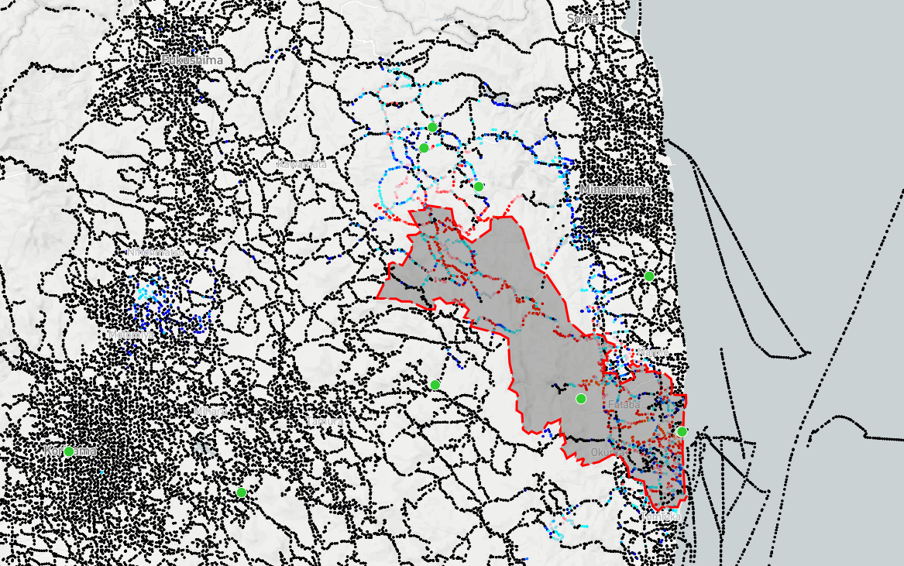

# mb-safecast-site

Plotting Safecast.org data on a Mapbox GL JS Map. This site came about as a project as part of [Mapbox's](http://github.com/mapbox) 2018 Community Days initiative.

The main tileset data is generated by the processing in https://github.com/drboyer/safecast-vt-gen.

## building and running

Frontend javascript work happens in the .js files in the src/ directory.

If you've just cloned this repo, you must first run `npm install` to install the
Node/JS modules locally.

Run `npm run start` to start a local webserver running at http://localhost:8080/.

This webserver will compile the .js files in the src/ directory and automatically
rebuild the output JavaScript whenever any files in the src/ are updated and saved.

If you want to manually build the output Javascript files without running the
development web server, you can run `npm run build`

## Contributing

We're still somewhat early in the process determining how we want this final site/map to look. A few starter tasks can be found
in this repo's [Issues](https://github.com/drboyer/mapbox-safecast-site/issues), but feel free to create a new issue or send a PR
if you have other ideas/suggestions.